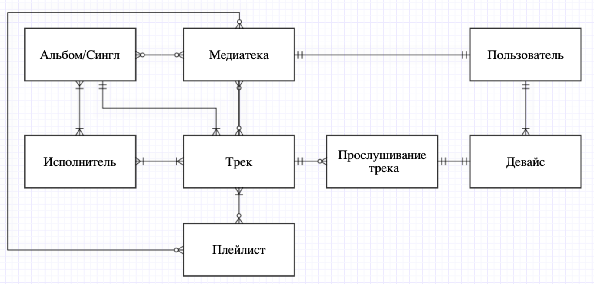

# Databases_MIPT
## Область - Сервис для прослушивания музыки
### Диаграмма описывает связи между следующими сущностями:
#### 1) Пользователь <-> Девайс
- Девайс всегда принадлежит ровно одному пользователю, но у пользователя может быть несколько девайсов, причем хотя бы один есть, иначе он не может быть пользователем музыкального сервиса.
#### 2) Пользователь <-> Медиатека
- У каждого пользователя есть его собственная медиатека, возможно пустая.
#### 3) Девайс <-> Прослушивание трека
- Прослушивание трека - сущность-факт, имеющая свой id. Под прослушиванием понимается факт трансляции аудио на конкретное устройство определенного пользователя. Понятно, что на одном девайсе нельзя прослушивать несколько треков, но при этом один и тот же трек может транслироваться на несколько устройств, возможно разных пользователей.
#### 4) Трек <-> Прослушивание трека
- Трек может никто не слушать, но прослушивать можно ровно один трек.
#### 5) Альбом/Сингл <-> Медиатека
- Альбом или Сингл могут принадлежать произвольному количеству медиатек, включая ноль, так же как и в одной медиатеке может быть произвольное количество альбомов или синглов.
#### 6) Альбом/Сингл <-> Исполнитель
- Как у одного исполнителя может быть любое количество Альбомов/Синглов, так и конкретного Альбома/Сингла может быть несколько исполнителей (feat.)
#### 7) Альбом/Сингл <-> Трек
- Каждый трек соответствует ровно одному Альбому или Синглу, приэтом альбом содержит несколько треков.
#### 8) Плейлист <-> Медиатека
- В медиатеку можно добавить сколько угодно плейлистов, один плейлист можно добавить в любое количество медиатек.
#### 9) Трек <-> Медиатека
- В медиатеку можно добавить сколько угодно треков, один трек можно добавить в любое количество медиатек.
#### 10) Трек <-> Плейлист
- Плейлист не бывает пустым, поэтому в него должно входить больше нуля треков, но при этом трек может не попасть ни в один плейлист
#### 11) Трек <-> Исполнитель
- Исполнитель без трека - не исполнитель, а трек должен кто-то исполнять)

